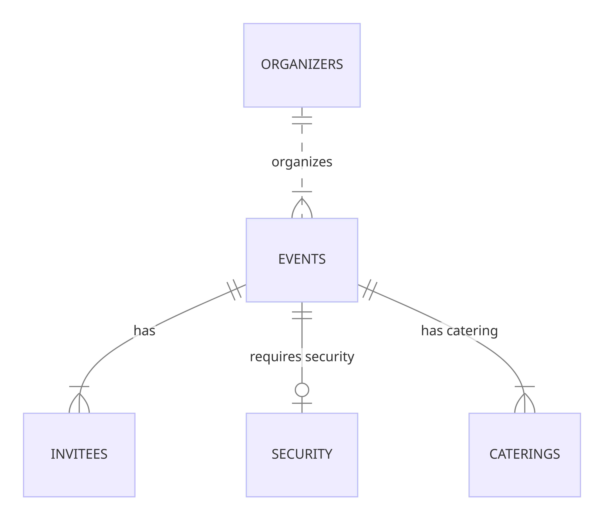

# Design Document

## Scope

My database is to be used by event organizers and invitees of an event to simplify the use and manipulation of event records.
My database includes people who attend or plan events(birthdays, graduations, marriages).
people not organizing or taking part in the type of events above would'nt make use of my database.

## Functional Requirements

There are 2 main users of the database
### Organizers
An organizer should be able to:
* Create an event record.
* View all the events he/she is in charge of.
* View all catering and security services that agency offers to that event he/she is in charge of.
* View all invitees of the event he/she is in charge of.

### Invitees
An invitee should be able to:
* View events he/she is invited to.
* View the organizer of the event he/she is attending.

## Representation

### Entities

#### <u style = "color:aqua">organizers</u>
This represents all the event planners/organizers in the database.

**id** which uniquely identifies each organizer and is of type INT.

**first_name**: The first_name of the organizer and is of type STRING.

**last_name**: The last_name of the organizer and is of type STRING.

**email**: The organizer's email address.

**phone_number**: The organizer's phone number and is of type STRING.

#### <u style = "color:aqua">events</u>
This represents all the events in the database.

**id** which uniquely identifies each event and is of type INT.

**name**: The name of the event and is of type STRING.

**type**: The type of the event and is of 3 categories(birthdays, graduations, marriages).

**location**: The location of the event and is of type STRING.

**date**: The date which the event is to take place and is of type STRING.

**attendees_number**: The number of invitees to take part in the event and is of type INT.

#### <u style = "color:aqua">security</u>
This represents all the security agencies being used by the events.

**id**: which uniquely identifies each security agency and is of type INT.

**name**: The name of the security agency and is of type STRING.

**email**: The email address of the security agency if they have one.

**phone_number**: The security agency's phone number and is of type STRING.

**event_id**: the id of the event which the security agency is in charge of.

#### <u style = "color:aqua">caterings</u>
This represents all the catering agencies being used by the events.

_Catering companies_: Prepare and serve food and beverages for events.
They may also offer additional services, such as equipment rental and setup.

**id** which uniquely identifies each catering agency and is of type INT.

**name**: The name of the catering agency and is of type STRING.

**email**: The email address of the catering agency if they have one.

**phone_number**: The security agency's phone number and is of type STRING.

**event_id**: the id of the event which the catering agency is in charge of.

#### <u style = "color:aqua">invitees</u>
This represents all the invitees to an event.

**first_name**: The first_name of the invitee attending an event.

**last_name**: The last_name of the invitee attending an event.

**email**: The email address of the invitee they have one.

**event_id**: the id of the event the invitee is to attend.

### Relationships

*__organizes:__* Between ORGANIZERS and EVENTS (one-to-many).
An organizer plans/organizes at least one event and an event is organized by only one organizer.

*__has:__* Between EVENTS and INVITEES (one-to-many).
An event has at least an invitee and an invitee attends only one event at a time.

*__requires security:__* Between EVENTS and SECURITY (one-to-one).
An event requires at most one security agency and a security agency is required by exactly one event at a time.

*__has catering:__* Between EVENTS and CATERING (one-to-many).
AN event has at least one catering service and a catering service is provided to exactly one event

## Optimizations

* I used indexes and views to optimize my database.

### indexes
<table>
    <thead>
        <th>name</th>
        <th>table</th>
        <th>column(s)</th>
        <th>Reason(s)</th>
    </thead>
    <tbody>
        <tr>
            <td>sys_events</td>
            <td>events</td>
            <td>name, type, date, location</td>
            <td>These columns are likely to be queried together for any query  on this table.</td>
        </tr>
        <tr>
            <td>attendees</td>
            <td>invitees</td>
            <td>name</td>
            <td>The column name is the most likely queried column</td>
        </tr>
         <tr>
            <td>catering</td>
            <td>caterings</td>
            <td>name</td>
            <td>The catering's agency name is the only column of interest likely to be queried</td>
        </tr>
         <tr>
            <td>secure</td>
            <td>security</td>
            <td>name</td>
            <td>The security's agency name is the only column of interest likely to be queried</td>
        </tr>
    </tbody>
</table>

### views
<table>
    <thead>
        <th>name</th>
        <th>table(s)</th>
        <th>column(s)</th>
        <th>Reason(s)</th>
    </thead>
    <tbody>
        <tr>
            <td>event_view</td>
            <td>events</td>
            <td>name, type, date, location</td>
            <td>Most required information on events come from these columns.</td>
        </tr>
        <tr>
            <td>security_view</td>
            <td>security</td>
            <td>name</td>
            <td>Required information on security by organizer</td>
        </tr>
        <tr>
            <td>invitee_view</td>
            <td>invitees</td>
            <td>name</td>
            <td>Information on invitees of an event</td>
        </tr>
        <tr>
            <td>catering_view</td>
            <td>caterings</td>
            <td>name</td>
            <td>Required information on catering by organizer</td>
        </tr>
    </tbody>
</table>

## Limitations

Since i encompassed services like food, drinks and halls as "catering service", manipulation might be a little bit complex than anticipated because we will need to contact more than one catering company if one doesn't have all the services required for that event.

My database is only capable of handling a limited number of events(birthdays, marriages, graduations).
